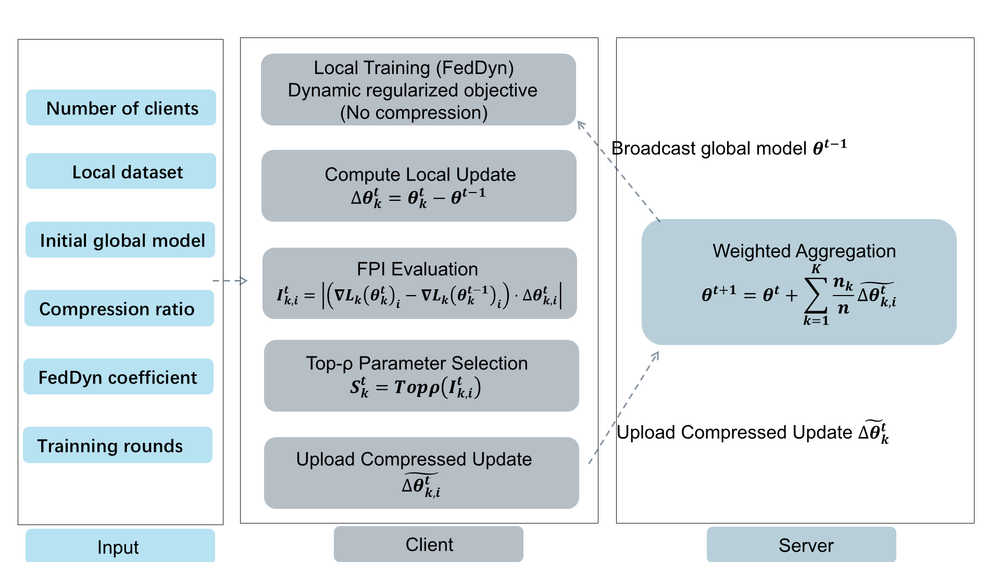

# A Communication-Efficient Compression Method for FedDyn Federated Learning Models

This repository contains the research code for a FedDyn-aware communication compression method under Non-IID federated learning.

The goal is to reduce the client-to-server communication overhead of FedDyn by selectively transmitting important model updates while largely preserving convergence behavior.

<p align="center">
  <a href="https://chenjl13.github.io/assets/files/ICCECT.pdf">📑 Paper</a>
</p>


## Overview

FedDyn improves federated optimization under heterogeneous client data by adding dynamic regularization to local training. This project keeps the FedDyn local optimization process intact and applies compression only after local training, during the client-to-server communication stage.

## New Proposed Architecture


## Method

For client $k$ at communication round $t$, the local update is:

```math
\Delta \theta_k^t = \theta_k^t - \theta^{t-1}
```

The FedDyn-aware Parameter Importance (FPI) score for parameter $i$ is:

```math
I_{k,i}^{t} = \left| \left( \nabla L_k(\theta_k^t)_i - \nabla L_k(\theta_k^{t-1})_i \right) \Delta \theta_{k,i}^{t} \right|
```

Parameters are ranked by FPI, and the largest $\rho$ fraction is selected for upload.  
$\rho = 1.0$ means full communication, while $\rho = 0.1$ means that the top 10% of parameters are selected.

## Repository Structure

```text
dataset/                  Dataset generation and generated metadata
system/main.py             Original training entrypoint
system/flcore/clients/     Client implementations
system/flcore/servers/     Server implementations
system/flcore/trainmodel/  Model definitions
system/utils/              Data loading, metrics, memory utilities
scripts/train.py           Thin root-level wrapper around system/main.py
results/h5/                Existing lightweight result curves
docs/method.md             Paper-to-code mapping and implementation notes
```

## Installation

Create the environment:

```bash
conda env create -f environment.yml
conda activate testdyn
```

For CUDA-enabled PyTorch, install the PyTorch build that matches your platform and CUDA driver. The environment checked during cleanup used:

```text
Python 3.11
NumPy 1.26.4
PyTorch 2.0.1+cu118
TorchVision 0.15.2+cu118
TorchAudio 2.0.2+cu118
TorchText 0.15.2
```

## Dataset

The experiments use MNIST, FashionMNIST, and CIFAR10 with Dirichlet label-skew Non-IID partitioning.

Current checked dataset metadata:

```text
num_clients = 20
partition = dir
dirichlet alpha = 0.1
train_ratio = 0.75
```

The generation scripts use `torchvision.datasets.*(..., download=True)` and save generated client shards under `dataset/<DATASET>/train` and `dataset/<DATASET>/test`.

Generate data from the repository root:

```bash
cd dataset
python generate_MNIST.py noniid - dir
python generate_FashionMNIST.py noniid balance dir
python generate_Cifar10.py noniid balance dir
```

Generated raw data and client shard files are ignored by Git.

## Running Experiments

Use the root-level wrapper:

```bash
python scripts/train.py --dataset mnist --algorithm feddyn_fpi --rho 0.2
```

The wrapper calls the original `system/main.py` without rewriting the training pipeline.

Equivalent direct command:

```bash
cd system
python main.py -data MNIST -m CNN -algo FedDyn -gr 200 -ls 5 -lbs 64 -lr 0.01 -al 0.001 --rho 0.2
```

## Baselines

```bash
python scripts/train.py --dataset mnist --algorithm fedavg --rounds 200
python scripts/train.py --dataset mnist --algorithm fedprox --rounds 200
python scripts/train.py --dataset mnist --algorithm moon --rounds 200
python scripts/train.py --dataset mnist --algorithm feddyn --rounds 200 --rho 1.0
```

Replace `mnist` with `fashionmnist` or `cifar10`.

## Compression Ratios

```bash
python scripts/train.py --dataset mnist --algorithm feddyn_fpi --rho 1.0
python scripts/train.py --dataset mnist --algorithm feddyn_fpi --rho 0.5
python scripts/train.py --dataset mnist --algorithm feddyn_fpi --rho 0.2
python scripts/train.py --dataset mnist --algorithm feddyn_fpi --rho 0.1
```

## Results

Existing lightweight HDF5 curves are stored in `results/h5/`.

The files named `MNIST_0.1.h5`, `MNIST_0.2.h5`, etc. are provided FedDyn-FPI compression result curves. Files named `MNIST_FedAvg.h5`, `MNIST_FedProx.h5`, `MNIST_MOON.h5`, and `MNIST_FedDyn.h5` are provided baseline result curves.

These HDF5 files have incomplete provenance. They do not store full command, seed, commit, or environment metadata, and some names do not match the current `save_results()` output pattern. Metrics derived by `scripts/summarize_results.py` may not exactly match all values reported in the paper tables, including parts of Table III-V. Do not treat the provided HDF5 files as exact table-reproduction artifacts.

Current code saves:

```text
rs_test_acc
rs_test_auc
rs_train_loss
```

## Communication Metric

To summarize the provided compression curves:

```bash
python scripts/summarize_results.py
```

## Citation

```bibtex
@inproceedings{chen2026communication,
  author    = {Chen, Jiale},
  title     = {A Communication-Efficient Compression Method for {FedDyn} Federated Learning Models},
  booktitle = {2026 IEEE 4th International Conference on Control, Electronics and Computer Technology (ICCECT)},
  pages     = {109--113},
  year      = {2026},
  doi       = {10.1109/ICCECT68671.2026.11565412}
}
```

## Acknowledgement

This repository is adapted from PFLlib, a personalized federated learning library and benchmark. If you use this code, please also acknowledge the upstream PFLlib project and its license.

```bibtex
@article{zhang2025pfllib,
  title={PFLlib: A Beginner-Friendly and Comprehensive Personalized Federated Learning Library and Benchmark},
  author={Zhang, Jianqing and Liu, Yang and Hua, Yang and Wang, Hao and Song, Tao and Xue, Zhengui and Ma, Ruhui and Cao, Jian},
  journal={Journal of Machine Learning Research},
  volume={26},
  number={50},
  pages={1--10},
  year={2025}
}
```

## License

This project keeps the original Apache-2.0 license from the upstream PFLlib codebase.
